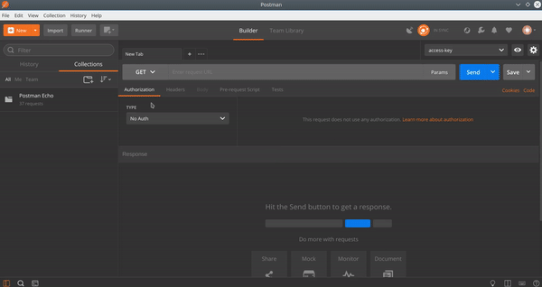

# Postman 

[Postman](https://www.getpostman.com/) is the tool for using and managing the API. 

Follow the steps to get the example 
1. Open Postman
2. Import [this](./Postman-guidelines)
3. Add environment variable (key) in the top right corner, which is your API access key of CarbonFootprint API.
4. Click on the required API call and click send for the response.

