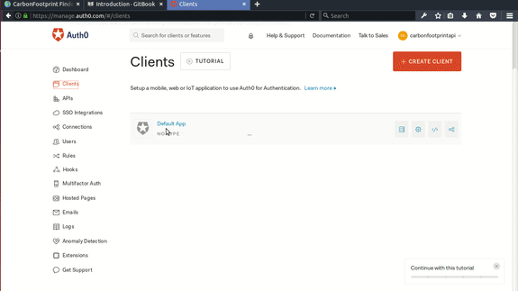

# Sign up on Auth0

Auth0 is an open source project but is not free for organization creating revenue, we as an open source organization really enjoy services of Auth0 to secure our APIs and user Authentication. To create an account on Auth0 signup [here](https://auth0.com/signup).

# Create a Client
After creating account on Auth0, click on [Clients](https://manage.auth0.com/#/clients) from the side options. Configure your client as below:

# You are almost there

Find config.json.example [here](https://gitlab.com/aossie/CarbonFootprint-API/blob/master/config.json.example) and auth0-config.js.example [here](https://gitlab.com/aossie/CarbonFootprint-API/tree/master/client/src/Auth/auth0-config.js.example)

* Add [config.json]() [here](https://gitlab.com/aossie/CarbonFootprint-API) with the same format as [config.json.example](). In `database` fill the database configuration. If you don't have one signup [here](https://mlab.com/signup/) .
     * Add Google distance matrix API key. Find one [here](https://developers.google.com/maps/documentation/distance-matrix/get-api-key) .
     * Add the `issuer` with `https://<userName>.auth0.com/.well-known/jwks.json`
     * Add the `jwksUri` with `https://<userName>.auth0.com/`
* Add [auth0-config.js]() [here](https://gitlab.com/aossie/CarbonFootprint-API/tree/master/client/src/Auth) with the same format as [auth0-config.js.example](https://gitlab.com/aossie/CarbonFootprint-API/tree/master/client/src/Auth/auth0-config.js.example)
     * Add `clientId` from the client you created above.
     * `domain` is `<userName>.auth0.com`.
     * Add `callbackUrl` with the one you added while making a client.
     * `tokenEndpoint` is `https://<userName>.auth0.com/oauth/token`
     * `apiEndpoint` is `https://<userName>.auth0.com/api/v2/users/`

# That's it. You are ready to go! 
