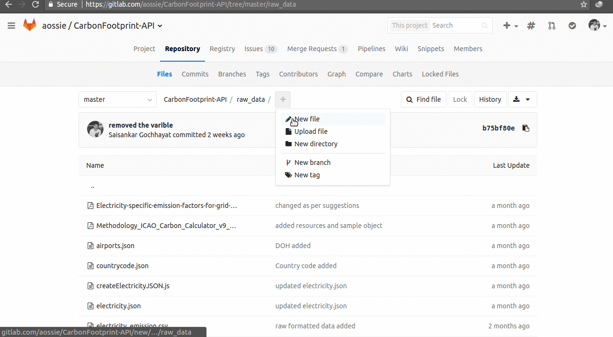

#Help us Grow

We would always like you to help us grow, be it in the form of an Idea, Data, Contributions, Precise results or anything related to Carbon Footprints. If you think you can help us with any of the above things, <strong>this page is for you</strong>.  
<strong>For code based contribution</strong> please fork our [repository](https://gitlab.com/aossie/CarbonFootprint-API) and make a [merge request](https://docs.gitlab.com/ee/gitlab-basics/add-merge-request.html) with the awesome feature that you made or a bug fix that could help others.

The aim of CarbonFootprint API is to offer a one place solution to all data related to Carbonfootprint with the most precise  results and we cannot do this without your help.
If there is any data file or JSON file or anything related to Carbonfootprint that you think can help us in finding more precise results or could find a place in our repository please make the Merge Request or send it via [mail](mailto:carbonfootprintapi@gmail.com). We will try to contact you as soon as possible.

### Making a Merge Request regarding additional Data Source -

