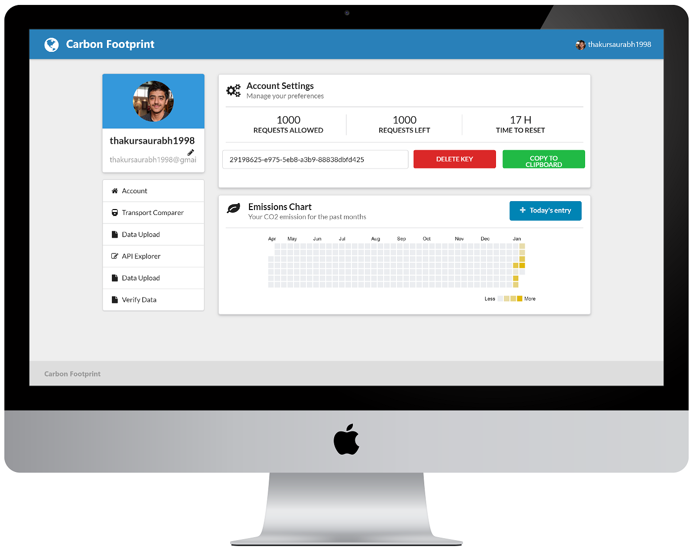
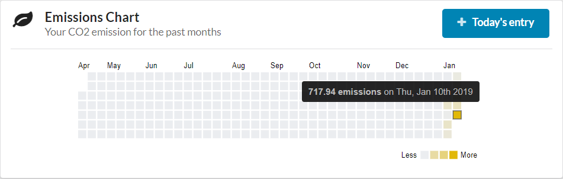

# **CarbonFootprint-API**

> Google Summer of Code '19 Final Submission Report

### **Student** - _Saurabh Thakur_

### Links

- **Project Repository:** https://gitlab.com/aossie/CarbonFootprint-API
- **Live Project:** https://carbonhub.org
- **Swagger API Documentation:** https://carbonhub.org/api/docs
- **Project Documentation:** https://docs.carbonhub.org

### Google Summer of Code '19:

_This year more focus was shifted on making the frontend of the dashboard more pleasing by adding more features as well as making the project more appealing and easy for the people who develop or want to develop to this open source project by improving the CI/CD of the project as well as development environment setup._

This years summer of code brought quite a few interesting changes to the CarbonFootprint-API project. I tried to make this project a little more up to date with new UI, refactored code, more tests and better DevOps.

It was really interesting to see how well the project is maintained because the transition was smooth, whether I was developing new things or I was refactoring them.  
So I started off by working on the client side of the application. Correcting bugs in the UI and also started working on updating version of `React`.  
During working with React I was facing an issue which was causing me a lot of frustration, the issue was the build time it was taking to show me the changes I made after changing the JSX code. In short words hot reloading was really slow. This was due to the webpack config which was used to build the client assets. This webpack config was not suitable for development life cycle, so to solve this problem I started finding solutions. I found two main solutions:

1. One was to create a separate webpack config for development and one for production level builds. This would need a lot of insight in webpack as well as would become an addition which needed to be manage.
1. To use `create-react-app` (_CRA_).

I started working on the latter solution. This decision wasn't random and there were proper reasons of doing that which we are going to discuss below:

- CRA managed the webpack config for dev and prod environments which was what we needed, but it also give a lot of other useful features.
- It provides with `react-scripts` which can help improve the dev lifecycle.
- It consists of multiple scripts, from starting the development server, to running the production build.
- And all of this comes out of the box, so a developer doesn't need to worry about the configuration of the project.
- It also solved another issue which we were facing was the usage of css styling in the JSX files.
- I had to configure my babel separately so that it can take account of these changes and do not break. CRA also handled this out of the box.

After doing all the necessary changes to all the files the client side was finally updated and the MR was merged.

I was also working on another solution which I proposed was to add a new feature of taking entry of daily user activities, from which we can calculate and track the Carbon emission of that user. This data could be shown to the user in the form of heatmap, just like gitlab shows the previous commits of a user.  
Creating the heatmap was also a challenge in itself, the library which I found after researching on the internet to visualize the data was [d3](https://d3js.org). The final result looked like this:

<table>
<tr><td align="center">  </td></tr>
<tr><td align="center"> <b>The profile page now shows a heatmap which displays the CO2 emission of a user over past few months.</b> </td></tr>
<tr><td align="center">  </td></tr>
<tr><td align="center"> <b>Hovering on a tile shows the emission of the day with the date</b> </td></tr>
</table>

Next what I did was to add [eslint](https://eslint.org/), which was a long awaited desire of this project.

### Technical Details

- [Docker](https://docker.com/) - To containerize the application for development and deployment purposes.
- [Docker Compose](https://docs.docker.com/compose/) - For runnin multiple services in container interacting with each other.
- [Gitlab Runner](https://docs.gitlab.com/runner/) - Gitlab runner is used for deployment of the project in the production server.
- [Swagger Documentation](https://swagger.io/) - Swagger made API documentation and first time usage really easy, so we added it to the platform
- [D3 JS](https://d3js.org/) - D3 is used in creating the user carbon emission heatmap in user profile.

### Merge Requests

- [**MR !134**](https://gitlab.com/aossie/CarbonFootprint-API/merge_requests/134) (_Improve responsiveness of profile page_)(_**merged**_)

  - The profile page components were out of alignment and were also not suitable for responsive usage across different devices.
  - Most of the components were corrected, and the profile page was refactored for better UI and UX.

- [**MR !138**](https://gitlab.com/aossie/CarbonFootprint-API/merge_requests/138) (_User's daily activity collection and CO2 emission visualization_)(_**merged**_)

  - Enhances how the user interacts with our platform.
  - Providing user the interface to add the daily activity to keep track of the Carbon Dioxide emission.
  - Also displaying all the previous year data in the form of a heatmap.

- [**MR !139**](https://gitlab.com/aossie/CarbonFootprint-API/merge_requests/139) (_Google maps API dependency removed and Microsoft Bing Maps API added_)(_**merged**_)

  - Refactored code uses Bing maps API to use functions like Distance Matrix and Locations API.
  - Module dependency of @google/maps also removed.
  - Docs updated with the new instructions to create key of Microsoft Bing Map API.
  - Configuration file examples also updated.
  - All the tests related to the maps API are now passing which can be seen [here in the respective commit pipeline job](https://gitlab.com/thakursaurabh1998/CarbonFootprint-API/-/jobs/148496840)

- [**MR !140**](https://gitlab.com/aossie/CarbonFootprint-API/merge_requests/140) (_pipeline error fix, correction in assertion value_)(_**merged**_)

  - Correction of wrong assertion value which was leading to failing of tests.

- [**MR !141**](https://gitlab.com/aossie/CarbonFootprint-API/merge_requests/141) (_Documentation change: adding gitlab env config_)(_**merged**_)

  - A lot of steps were missing to add the environment variables and setting up the development environment of the project.
  - Adding steps to add gitlab config env variables in documentation.

- [**MR !143**](https://gitlab.com/aossie/CarbonFootprint-API/merge_requests/143) (_Initialized swagger_)(_**merged**_)

  - Made api documentations for different API paths
  - Serving the docs on /api/docs path from where the user can directly make API calls and check the response structure without doing any input
  - Making use of JSDocs
  - Custom documentation css styles for better UI of the API doc page
  - Tests can be made on local development servers as well as production API

- [**MR !144**](https://gitlab.com/aossie/CarbonFootprint-API/merge_requests/144) (_Region value changed to default_)(_**merged**_)

  - This MR was done to correct the failing of the pipeline.

- [**MR !149**](https://gitlab.com/aossie/CarbonFootprint-API/merge_requests/149) (_readme doc changes_)(_**merged**_)

  - Add the services used in the documentation, i.e. redis, mongo for the clarity of services to developers.

- [**MR !150**](https://gitlab.com/aossie/CarbonFootprint-API/merge_requests/150) (_CORS was configured on the server side_)(_**merged**_)

  - For cross site requests during development and other purposes, cors is implemented on the server side.
  - Only whitelists specific urls.

- [**MR !151**](https://gitlab.com/aossie/CarbonFootprint-API/merge_requests/151) (_React v16.8_)(_**merged**_)

  - React version bump to latest `16.8`.
  - Directory structure and implementation of client side changed.
  - Webpack build was removed and create-react-app was used to make development lifecycle fast and efficient.
  - Previously load time after changing a jsx file was ~5 seconds.
  - Was decreased drastically on usage of CRA with help of react development builds and dev server provided within CRA.
  - Deployment script was also changed and react-scripts build was used to generate static asset files.

- [**MR !152**](https://gitlab.com/aossie/CarbonFootprint-API/merge_requests/152) (_HOTFIX_)(_**merged**_)

  - This was an hotfix of an old bug in the API code.

- [**MR !153**](https://gitlab.com/aossie/CarbonFootprint-API/merge_requests/153) (_Changing urls to https from http_)(_**merged**_)

  - Many libraries were imported as a script directly using a URL and not as a package.
  - In these URLs `http` was used which was raising an error when they were called from a `https` page.
  - This was resolved in this merge request.

- [**MR !155**](https://gitlab.com/aossie/CarbonFootprint-API/merge_requests/155) (_Removing constant mongoose deprecation warning_)(_**merged**_)

  - Mongoose constantly threw an error of deprecation of promises of its library.
  - This was fixed by changing the promise property of mongoose with native javascript promise.

- [**MR !156**](https://gitlab.com/aossie/CarbonFootprint-API/merge_requests/156) (_gitbook build permission access_)(_**merged**_)

  - Fix of an old bug in the deploy script.
  - The script wasn't able to build the gitbook documentation and the documentation wasn't opening because of the missing `sudo` keyword.
  - Issue was fixed and gitbook docs were built on production server.

- [**MR !157**](https://gitlab.com/aossie/CarbonFootprint-API/merge_requests/157) (_removing unnecessary package and files_)(_**merged**_)

  - Older webpack config removed.
  - Packages which weren't used anymore were removed and `package.json` updated.

- [**MR !158**](https://gitlab.com/aossie/CarbonFootprint-API/merge_requests/158) (_Adding ESLint_)(_**merged**_)

  - All the javascript files weren't following any guidelines for writing code. There was no linting present. The code was highly unstructured and varied on different files.
  - ESLint config file was added with `airbnb` configs as a base config.
  - All the files were reformatted and changes were made like arrow functions, use of let and const, etc.
  - Lint tests were also added in `gitlab-ci` to test the linting in each code push.

- [**MR !159**](https://gitlab.com/aossie/CarbonFootprint-API/merge_requests/159) (_Documentation fixes_)(_**merged**_)

  - A lot of docs needed to be updated because of the changes of client side changes after intro of CRA.

- [**MR !160**](https://gitlab.com/aossie/CarbonFootprint-API/merge_requests/160) (_FIX: mapdata dependent endpoints_)(_**merged**_)

  - Old bug fix of map data.
  - There was a logical error in the code when calculating emissions.

- [**MR !161**](https://gitlab.com/aossie/CarbonFootprint-API/merge_requests/161) (_FIX: default color when no data available_)(_**merged**_)

  - Heatmap was showing wrong color whent there was no user data present.
  - Changed the default colour to grey.

- [**MR !162**](https://gitlab.com/aossie/CarbonFootprint-API/merge_requests/162) (_Tests divided to more structured way using describe and more tests_)(_**merged**_)

  - Tests were not classified so I grouped them according to their API endpoints.
  - The tests status printed in the CI are now more readable and are grouped.
  - More tests were added for some new API endpoints as well as previous uncovered parts.

- [**MR !164**](https://gitlab.com/aossie/CarbonFootprint-API/merge_requests/164) (_Dockerfile init with docker-compose_)(_**open**_)

  - The app is containerized using `Docker`.
  - Docker compose used for fast setup of development environment as well in production for the services used in API (i.e. redis).
  - Setting up of project becomes very easy with only a single command.
  - The deployment of the project is also changed which takes use of the `Gitlab` CI/CD which is declared in the `gitlab-ci.yml file.
  - On server we have a `gitlab-runner` daemon running which listens for any deployment trigger from the gitlab platform.
