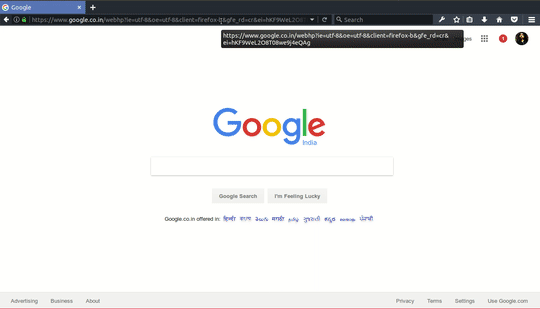

# Prerequisites

At the time of development we were using :
`yarn : 0.27.5` or higher
`node : v8.1.2` or higher

To check your current versions :

```
  yarn --version
  node --version
```

# Building and Development Versions (v1)

* In the root of repository add config.json file.

```JSON
{
    "database":{
        "username": "username",
        "password": "password",
        "port": "serving port"
        "dbname": "database name",
        "hostname": "host name"
    },
    "apikeys":{
        "googlemap": "Google Maps API key"
    }
}
```

 For 500 Mb Free services on MongoDB databases, signup [here](https://www.mlab.com/signup) (or you can use any other service of your choice).

* To install all the require modules and build file:

```
yarn install
yarn run build
```

* Before testing APIs on your local node server, please follow any of the following instructions according to requirement(s) (this might take some time)

    * To add all the data 
       ```
       yarn run all
       ```
    * To add electricity data
      ```
      yarn run electricity
      ``` 
    * To add flights data
      ```
      yarn run flights
      ```
    * To add vehicles data
      ```
      yarn run vehicle
      ```
    * To add trains data
      ```
      yarn run trains
      ```
    * To add trees data
      ```
      yarn run trees
      ```
      
Note : For details on [yarn](https://yarnpkg.com) installation and usage [click here](https://yarnpkg.com/en/docs/usage)

* To start the server, run `yarn start`.

* To run the unit tests, use `yarn test`.

# Get API key



# Licenses

* GNU-GPL-3.0

* CC-By-NC-ND [](http://creativecommons.org/licenses/by-nc-nd/4.0/)
