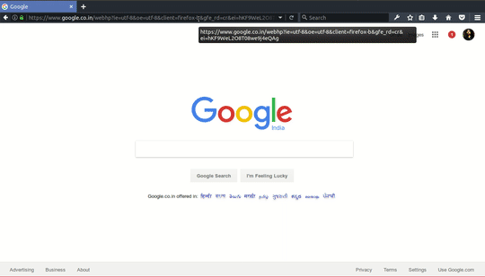

# Get a Carbon footprint API key
To access the Carbon Footprint API you need a API access key. This can be easily obtained by signing in into *[carbonhub.org](https://carbonhub.org)*. Pass this access key as a header on every request to access the API. Checkout the API reference for sample API requests. The API currently permits 1000 requests per day. Contact us to request more.

